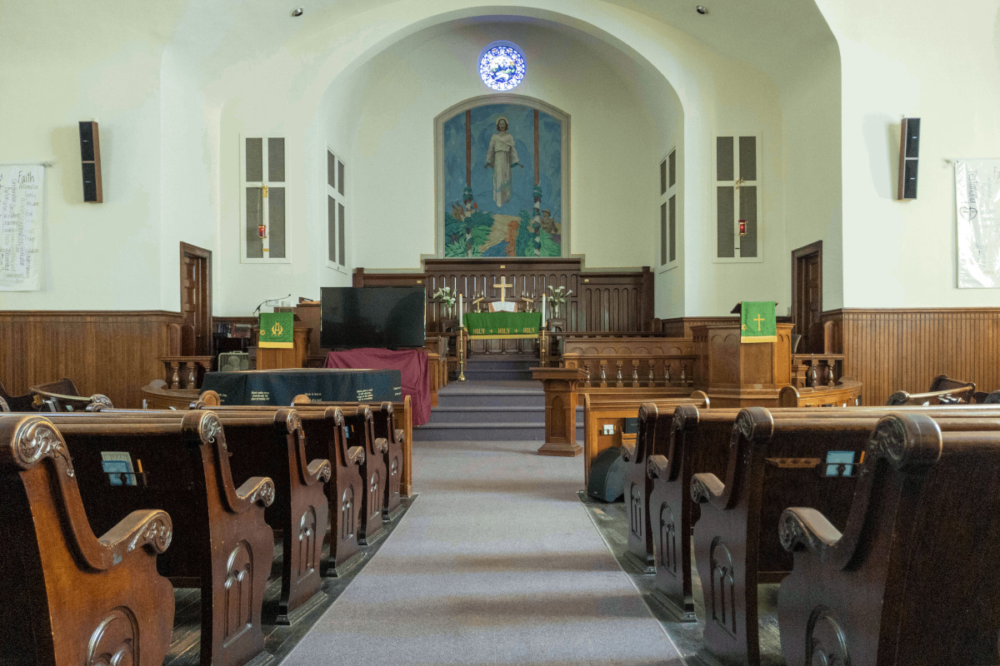

St. John’s United Church of Christ is more than just a place of worship. We are an enduring family. Some of our members have been attending our church since they were children. Some still remember when the sanctuary had a balcony with a lovely view of the little stained-glass window in what is now the attic, or when the back wall of the sanctuary was covered in decorative organ pipes before we hired a struggling, formerly-incarcerated person during the Great Depression to paint the now-iconic “Man with a Hoe” which adorns the sanctuary wall.

We are a loving family. We’re located in the heart of downtown Jackson because we believe this is where we can do the most good for our community. We provide showers for houseless persons, our Samaritan Fund provides financial assistance to people facing evictions and utility shutoffs, our Food Pantry feeds hundreds of people each month, and our Annual Baby Shower provides diapers, clothing, and education for hundreds of mothers. Through thick and thin, we are bound together by a transcendent love.

We are a family who stands up for what’s right. We are an LGBT+ friendly church in Jackson. We acknowledge the systematic oppression of black, brown, and indigenous people in our country and in our communities, and the ways in which we benefit from that system. We believe in the dignity of human beings, regardless of gender, sexuality, religion, heritage, nationality, citizenship status, race, ethnicity, incarceration status, medical condition, socioeconomic status, marital status, body art, ability, disability, drug use, education level, etc. We’ve put that belief in action by helping to found the Jackson NAACP, the Jackson Pride Center, and Partnership Park, and by sharing our space with the American Red Cross, the Jackson NAACP, CAA Head Start, and the Dungytreei Heritage Foundation.