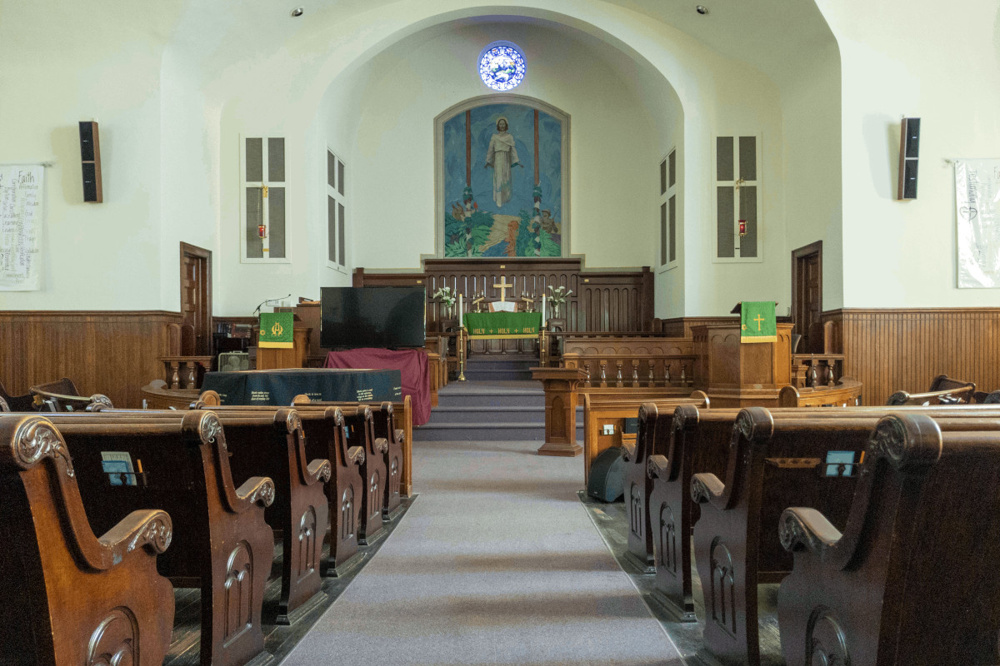

## St. John's United Church of Christ

St. John’s United Church of Christ is more than just a place of worship. We are an enduring family. Some of our members have been attending our church since they were children. Some still remember when the sanctuary had a balcony with a lovely view of the little stained-glass window in what is now the attic, or when the back wall of the sanctuary was covered in decorative organ pipes before we hired a struggling, formerly-incarcerated person during the Great Depression to paint the now-iconic “Man with a Hoe” which adorns the sanctuary wall.

We are a loving family. We’re located in the heart of downtown Jackson because we believe this is where we can do the most good for our community. We provide showers for houseless persons, our Samaritan Fund provides financial assistance to people facing evictions and utility shutoffs, our Food Pantry feeds hundreds of people each month, and our Annual Baby Shower provides diapers, clothing, and education for hundreds of mothers. Through thick and thin, we are bound together by a transcendent love.

We are a family who stands up for what’s right. We are an LGBT+ friendly church in Jackson. We acknowledge the systematic oppression of black, brown, and indigenous people in our country and in our communities, and the ways in which we benefit from that system. We believe in the dignity of human beings, regardless of gender, sexuality, religion, heritage, nationality, citizenship status, race, ethnicity, incarceration status, medical condition, socioeconomic status, marital status, body art, ability, disability, drug use, education level, etc. We’ve put that belief in action by helping to found the Jackson NAACP, the Jackson Pride Center, and Partnership Park, and by sharing our space with the American Red Cross, the Jackson NAACP, CAA Head Start, and the Dungytreei Heritage Foundation.

## Westminster Presbyterian Church

Westminster is a Church: a gathering of people who journey together in faith out of our shared trust in Jesus Christ. We are at various stages on that faith journey. We come together for worship, and go out to serve. Along the way, we also enjoy eating and have some fun together!

We really do welcome everyone! "God’s grace has openly welcomed us to the love and redemption that are ours through Jesus Christ. Reflecting the love that Jesus Christ offers to all, Westminster Presbyterian Church welcomes every person to participate in all aspects of our church community regardless of sexual orientation, color, gender identity, religious background, social or economic class, ethnicity, nationality, or ability. We consciously strive to create an environment of mutual respect, hospitality and warmth in which none are strangers and all may flourish as we seek to love and serve God and neighbor in our worship and ministries together."

Westminster is a congregation of the Presbyterian Church USA (PCUSA). What Do Presbyterians Stand For?
​
> 1. Presbyterians are formed and re-formed by God’s Holy Spirit through the Word of God.
> 2. Presbyterians stand for the majesty, praise and rule of God.
> 3. Presbyterians are more concerned about the Glory of God and the coming of God’s Kingdom than the salvation of souls.
> 4. Presbyterians depend more on grace and less on guilt.
> 5. Presbyterians believe that they are called to live in worship and community.
> 6. Presbyterians engage their minds and wills for God
>
> From Rodger Nishioka, presentation to the National Presbyterian Youth Ministry Conference, 1990.  Used with permission.