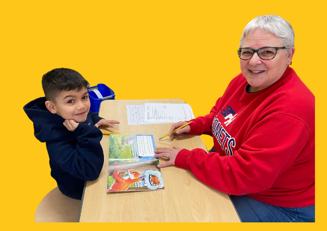

## We are accepting applications for our Literacy Coaching program!

### Program is Currently Free

The "NHL@SJUCC" is an outreach program that offers literacy coaching for students ages 5-12. Our purpose is to support students by increasing their confidence in reading which we believe will improve their academic success. The initiative was founded by the Hackworth family in 2022.

**Over 160 coaching sessions have been provided since the program's inception!**

#### Endorsements

> With the strategies and practices that the program has implemented along with the one on one instruction, I have not only seen an increased ability with phonetics, fluency, and in comprehension, but, maybe most importantly, I have also seen a huge increase in DJ's confidence. He is excited for group reading and enjoys teaching others about the reading strategies that he has developed.   &mdash;Alivia Demeuse, Elementary Teacher

> This year, my daughter has improved two grade levels based on reading tests conducted from the beginning to the end of the school year. This remarkable progress is due to a combination of in-class learning and the dependable, effective, and kind literacy individual coaching she receives from the team at the NHL initiative at SJUCC. Our plan is to continue with the coaching through the summer and into the next school year. The NHL experience has exceeded my expectations!   &mdash;Julie H., Mom